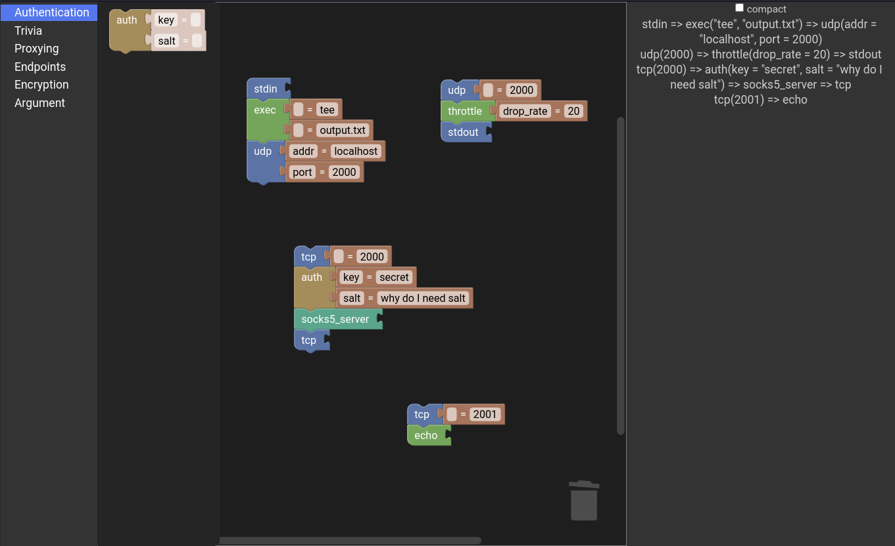

Sopipe
======

Sopipe is socat with middlewares. It can be used for NAT penetration, secured* and accelerated transmission, tunnelling,
port forwarding, proxying<sup>†</sup>, etc. with arbitrarily chained encryption, compression, authentication, and error
correction.

\* Sopipe has not undergone any security review. The encryption-related components should be used at own risk. <br>
<sup>†</sup> Sopipe is not designed for circumventing censorship. The authors and contributors do not take any
responsibility for abuse or misuse of this software.

## Installation

Download the latest release at [the release page](https://github.com/ylxdzsw/sopipe/releases) and drop it anywhere.
Sopipe is a single static linked binary that does not read or generate any file unless explicitly scripted.

## Usage

### Cli

Sopipe expects one and only one argument: the input script. The behaviour of sopipe is controlled solely by the script.
No commandline options are provided and no environment variables are read.

Shell tips: use single quote for the script so you don't need to escape the quotes and `!!` operations. For example:

```sh
sopipe 'stdin => exec("tee", "record.txt") !! drop => stdout'
```

If the script is long and saved in a file, you can use some shell tricks:

```sh
sopipe "$(< script.txt)"
```

Run sopipe with empty argument will print the version and enabled features.

### Script

Sopipe uses an [extreamly simple DSL](https://github.com/ylxdzsw/sopipe/blob/master/src/script.pest) to describe the
pipeline. Take a look at [the examples](https://github.com/ylxdzsw/sopipe#gallery) to get a sense of it.

A "function call" defines a node, and `=>` operators are used to connect the nodes. The arguments of a node can have
three forms: key-value pair, key-only, or value-only. If no arguments are needed, the parentheses can be omitted too.
`!!` operators can used to composite two nodes, such that the one on the left is used for forwarding and the other for
backwarding.

`:=` operator binds a node to a name. This is necessary for feeding multiple inputs to a node. The RHS of the `:=`
operation can be a pipe `=>`, in which case the last node in the pipe is bound to the name.

`$a.b => foo()` connects `$a` and `foo()` with a specific name `b`. Some components use names to recognize the role of
each output. Named outputs can also be specified inline. For example, `foo(.b => bar()) => baz()` will connect a `foo`
component with two outputs, one is `bar()` with the name `b`, and the other is `baz()`. Anonymous outputs can also be
inlined with only a dot. For example, `stdio => tee(. => tcp("localhost:2000"), . => tcp("localhost:2001"))`.

All whitespaces `" ", "\t", "\n"` are treated equivalently. So the previous example can be written as:

```
stdio => tee(
    . => tcp("localhost:2000"),
    . => tcp("localhost:2001")
)
```

### Blockly Builder

Why write scripts when you can just drag and drop some colorful blocks? Try the builder at
[https://blog.ylxdzsw.com/sopipe/](https://blog.ylxdzsw.com/sopipe/). Note that the builder is unfinished and not all
scripts can be built using the builder (e.g. currently it does not support multiple inputs or outputs).



## Modules

Currently the following components are avaliable. More to come™.

#### Endpoints

- [tcp]: Listen to a tcp port or send to a (remote) tcp port. If the stream is directed (e.g. produced by
  `socks5_server`), the output `tcp` node don't need arguments about destination.
- [udp]: Similar to `tcp` but for UDP.
- [stdio]: Read or write to STDIN / STDOUT.

[tcp]: https://github.com/ylxdzsw/sopipe/tree/master/components/tcp
[udp]: https://github.com/ylxdzsw/sopipe/tree/master/components/udp
[stdio]: https://github.com/ylxdzsw/sopipe/tree/master/components/stdio

#### Proxying

- [socks5]: The [SOCKS protocol](https://tools.ietf.org/html/rfc1928).

[socks5]: https://github.com/ylxdzsw/sopipe/tree/master/components/socks5

#### Authentication

- [auth]: A simple authentication components based on preshared keys and MAC. It has two methods: *time* (default) and
  *challenge*. In the *time* method, the client sends the current timestamp and MAC for verification. In the *challenge*
  method, the server actively sends a nounce and the client replies with MAC.

[auth]: https://github.com/ylxdzsw/sopipe/tree/master/components/auth

#### Encryption

- [xor]: Not really encrypt, but `xor` the stream with a fixed key.
- [aead]: Various AEAD cyphers using [ring].

[xor]: https://github.com/ylxdzsw/sopipe/tree/master/components/xor
[aead]: https://github.com/ylxdzsw/sopipe/tree/master/components/aead
[ring]: https://github.com/briansmith/ring

#### Scripting / Debugging

- [exec]: Spawn an external process and connect to its STDIN / STDOUT. This allows integrating virtually anything with
  substantial performance penalty.
- [throttle]: Limit the flow rate like packets per second, byte per second, or randomly drop packets.
- [tee]: Broadcast to all outputs.
- [balance]: Choose one output for each stream ("anycast").
- [drop]: Discard whatever received.
- [echo]: Reply whatever received.

[exec]: https://github.com/ylxdzsw/sopipe/tree/master/components/exec
[throttle]: https://github.com/ylxdzsw/sopipe/tree/master/components/throttle
[tee]: https://github.com/ylxdzsw/sopipe/tree/master/components/tee
[balance]: https://github.com/ylxdzsw/sopipe/tree/master/components/balance
[drop]: https://github.com/ylxdzsw/sopipe/tree/master/components/drop
[echo]: https://github.com/ylxdzsw/sopipe/tree/master/components/echo

## Performance

A micro benchmark about the local tcp port forwarding throughput using `iperf3`.

```sh
iperf3 -s
iperf3 -c localhost -p 2000
socat -b65536 TCP-LISTEN:2000,fork TCP:127.0.0.1:5201
sopipe 'tcp(2000) => tcp("127.0.0.1", 5201)'
```

|        |   Throughput   |
| ------ | -------------- |
| Direct | 32.5 Gbits/sec |
| Socat  | 16.1 Gbits/sec |
| Sopipe | 12.4 Gbits/sec |

Addtional benchmarks:

```sh
sopipe 'tcp(2000) => xor("a") => xor("a") => tcp("localhost:5201")'
sopipe 'tcp(2000) => aead_encode("a") => aead_decode("a") => tcp("localhost:5201")'
```

|      |   Throughput   |
| ---- | -------------: |
| XOR  |  677 Mbits/sec |
| AEAD | 3.35 Gbits/sec |


## Gallery

